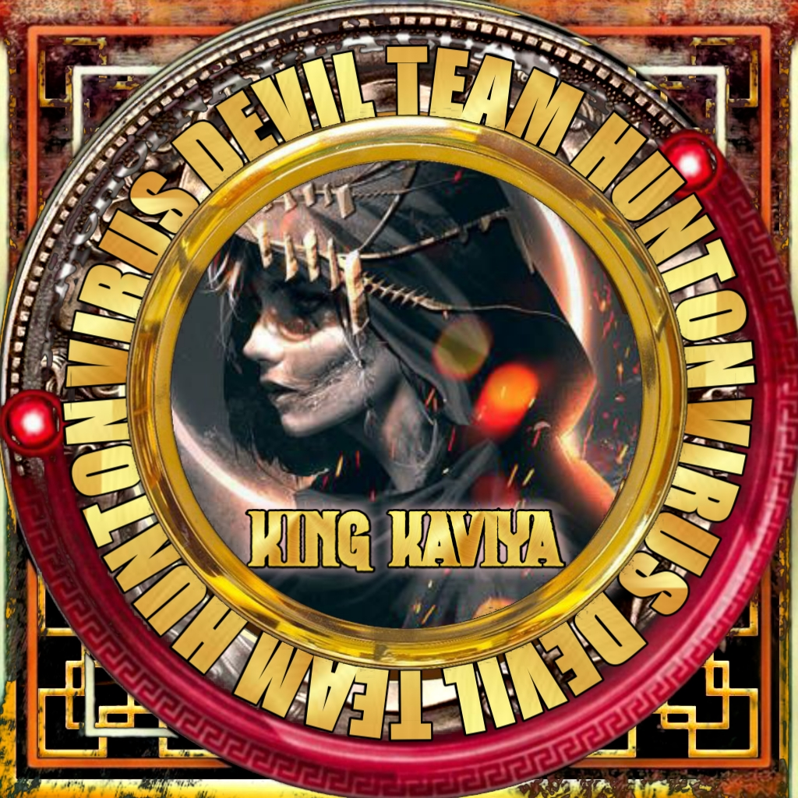

<div align="center">
  
  <p align="center">
    
    
<a href="#"></a>
</p>
  <p align="center">
<a href=https://github.com/Chunkindepadayali"></a>
</p>
</div>
<p align="center">
Project created by <a href="https://github.com/Chunkindepadayali">LIZA MWOL</a> to make it public
    <br>
       | 漏 |
        Reserved |
    <br> 
</p>

## Setup
<div align="center">

  ### Simple Method
  
[](https://heroku.com/deploy?template=https://github.com/Chunkindepadayali/LIZA-MWOL) 
  
[](https://replit.com/@chunkindepadayali/LizaMwol?v=1)
  

----

  <p align="center">
  <a href="https://github.com/Chunkindepadayali/LIZA-MWOL">
    
<a href="https:https://github.com/Chunkindepadayali?tab=followers">

<p align="center">
<a href="https://github.com/Chunkindepadayali/followers"
</a>
<a href="https://github.com/Chunkindepadayali/LIZA-MWOL/stargazers/"></a>
<a href="https://github.com/Chunkindepadayali/LIZA-MWOL/network/members"></a>
<a href="https://github.com/Chunkindepadayali/LIZA-MWOL/watchers"></a>
</p>

<p align="center">
<p>&nbsp;</p>
    
## 馃摙 Guide
Click WA logo to Join Support Group 馃憞
    <br>
<br>
  [](https://chat.whatsapp.com/BRPbS6JHUoCE480MpLLM5z)
  <div align="center">
       
  
  </div>
 
  
  [](https://chat.whatsapp.com/BRPbS6JHUoCE480MpLLM5z)
                     
### 鈿狅笍 Warning! 
```
Due to Userbot; Your WhatsApp account may be banned.
This is an open source project, you are responsible for everything you do. 
Absolutely, Asena executives do not accept responsibility.
By establishing the Asena, you are deemed to have accepted these responsibilities.
```

